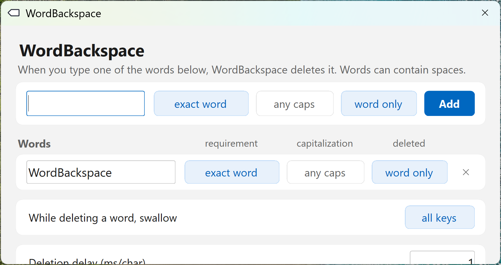

# WordBackspace
WordBackspace is a configurable Windows tray app that silently backspaces words you type, the moment you type them.



## Features

- Word list managed from the settings window (double-click the tray icon); changes save as you type
- Per-word options: exact match only vs partial, case sensitivity, word boundary only
- Deletion burst options: swallow all typed keys or only Enter, and a per-character delay (0-500 ms)
- Optional start at login (registry Run key)
- Light/dark theme

## Data locations

All in `%APPDATA%\WordBackspace\`:

- `words.json` - the word list
- `settings.json` - swallow mode and deletion delay
- `wordbackspace.log` - log (rotates at 1 MB)

## Republishing the exe

Requires the .NET 9 SDK on Windows. From the folder containing the `.csproj`:

```
dotnet publish -c Release -r win-x64 --self-contained true -p:PublishSingleFile=true -p:IncludeNativeLibrariesForSelfExtract=true -p:EnableCompressionInSingleFile=true -p:PublishTrimmed=true -p:_SuppressWinFormsTrimError=true -o publish
```

## Disclaimer

I used llms to make this program in a short time window.
